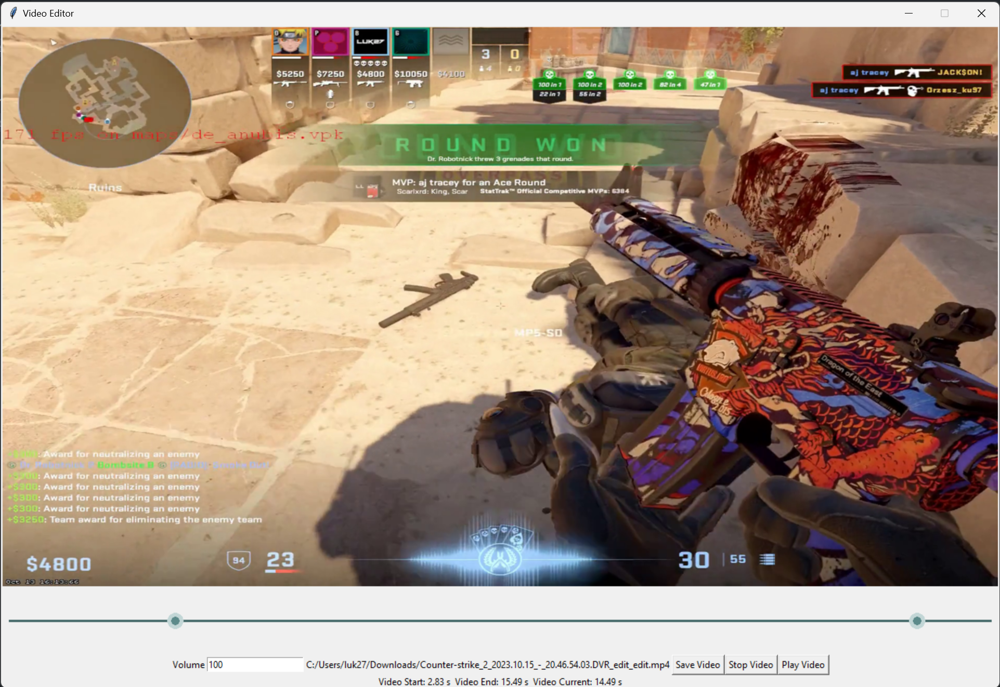

# MP4 simple editor

This repository contains files for my own Python MP4 video editor used to quickly cut MP4 videos and change the video volume.

The video editor is rather simple and used mostly for my purposes. There are a few improvements that may be done mentioned in GH issues (PRs welcome).

## Features

- drag and drop video upload
- compress MP4 videos while keeping FPS the same
- quickly cut videos with timeline slider
- adjust video volume
- preview cut video directly in the editor

Ensure you have Python 3.8 or newer with `venv`. Before running the clone, make sure that you have symlinks enabled - `git config core.symlinks true`. On Windows, "developer mode" is required (Settings -> Privacy and security -> Developer options -> Enable developer mode).

## Install (Windows)

1. `py -m venv env`
2. `.\env\Scripts\activate`
3. `py -m pip install -r requirements.txt`
4. `git submodule update --init --recursive`

## Install (Linux/MacOS)

1. `python3 -m venv env`
2. `source env/bin/activate`
3. `py -m pip install -r requirements.txt`
4. `git submodule update --init --recursive`

## Usage

Run `python editor.py`.

Have fun :)